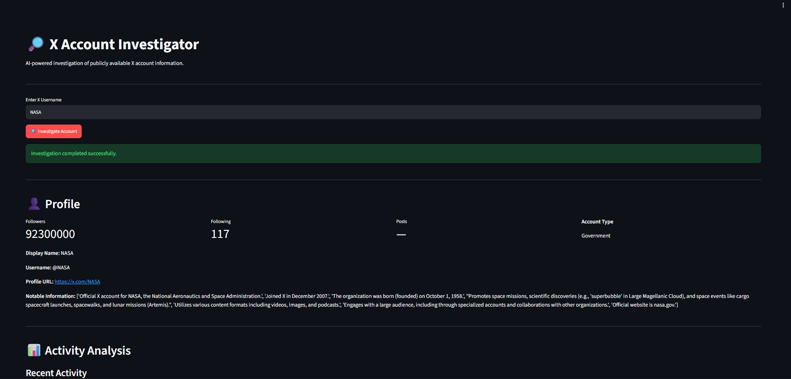

# 🔎 X Account Investigator

An AI-powered X (Twitter) account investigation system that autonomously collects, analyzes, verifies, and reports publicly available information about an X account.

The system uses multiple specialized AI agents to investigate different aspects of an account and then combines their findings through an evidence verification agent.

---

## 🚀 Features

- 🔍 X account profile investigation
- 📊 Recent activity and topic analysis
- 🕵️ Identity and professional background investigation
- 🔬 Evidence verification and conflict detection
- 📄 Automated PDF investigation report
- 🖥️ Interactive Streamlit web interface
- 🤖 Multi-agent architecture using LangChain
- 🌐 Web research using Tavily Search
- 🧠 Gemini LLM for AI-powered analysis
- 📦 Pydantic structured outputs
- 🔐 Environment variables for API keys

---

# 🏗️ System Architecture

The system consists of five specialized agents.

```text
                    X USERNAME
                         │
                         ▼
              ┌─────────────────────┐
              │  Agent 1             │
              │  Profile Analyzer    │
              └──────────┬──────────┘
                         │
                         ▼
              ┌─────────────────────┐
              │  Agent 2             │
              │  Activity Analyzer  │
              └──────────┬──────────┘
                         │
                         ▼
              ┌─────────────────────┐
              │  Agent 3             │
              │  Identity OSINT     │
              └──────────┬──────────┘
                         │
                         ▼
              ┌─────────────────────┐
              │  Agent 4             │
              │  Evidence Verifier  │
              └──────────┬──────────┘
                         │
                         ▼
              ┌─────────────────────┐
              │  Agent 5             │
              │  Report Generator   │
              └──────────┬──────────┘
                         │
                         ▼
                  PDF INVESTIGATION
                       REPORT